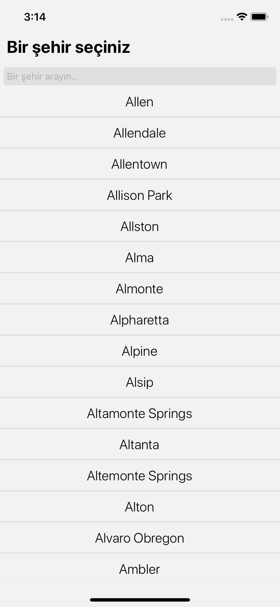
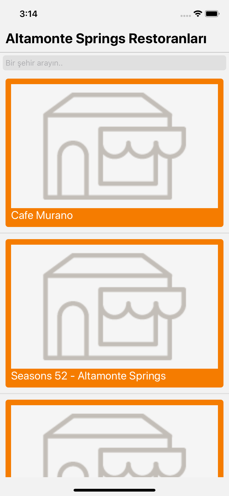
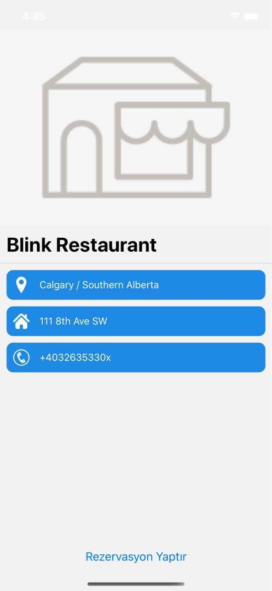

# Project-011 : City-Yelp App (RN-04)

## Description

Project aims to create Yelp Alternative Application with React Native.

## Problem Statement

- Your company has recently started on a project that aims to create an alternative to Yelp Application for the municipal usage. So you and your colleagues have started to work on the project.

## Expected Outcome

### At the end of the project, following topics are to be covered;

- HTML

- CSS

- JS

- React Native

### At the end of the project, students will be able to;

- improve coding skills within HTML & CSS & JS & React Native.

- use git commands (push, pull, commit, add etc.) and Github as Version Control System.

## Steps to Solution

- Step 1: Download or clone project repo on Github

- Step 2: Create project folder for local public repo on your pc

- Step 3: Create News Page with React Native.

**
&#9786; Happy Coding &#9997;
**
